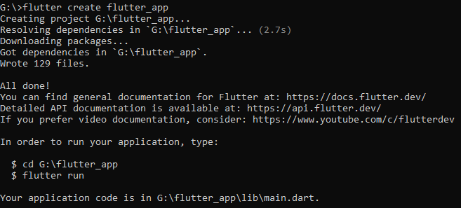
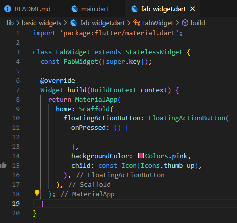

1. Praktikum 1 - Membuat Project Flutter Baru
Kita bisa menentukan dimana project akan disimpan.

Pada percobaan ini, saya menggunakan terminal untuk membuat project flutter yang baru.
Hal itu dilakukan dengan memasukkan perintah 'flutter create nama-project'.

2. Praktikum 2 - Membuat Repository Github
Klik pada bagian 'Publish to Github' untuk dibuatkan repository secara otomatis, dan selanjutnya cukup ikuti langkah-langkahnya saja.

Jika pada akun github yang kita miliki muncul repository baru seperti gambar dibawah, berarti pembuatan repository-nya telah berhasil.

3. Praktikum 3 - Menerapkan Widget Dasar
Buat file imageWidget.dart dan textWidget.dart didalam folder widget.

Untuk menampilkan gambarnya, perlu percobaan tambahan.
Pertama, buat folder 'assets'. Dan didalamnya buat folder 'images'. Didalam folder 'image' tersebut digunakan untuk menyimpan gambar yang diperlukan didalam apps.

Selain itu, pada file pusbec.yaml perlu dituliskan:
assets: 
   - path_gambar

Tampilan Hasil Praktikum

4. Praktikum 4 - Menerapkan Widget Material Design dan iOS Cupertino
a. Cupertino Button
Buat file loading_cupertino.dart didalam folder basic_widget.

Untuk file main.dart nya.

Tampilan hasil praktikum

b. Floating Action Button (FAB)
Buat file fab_widget.dart didalam folder basic_widget.

Untuk file main.dart nya.
